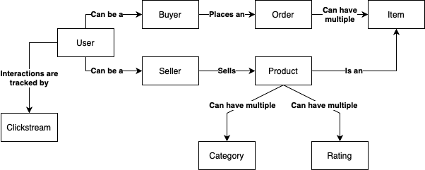
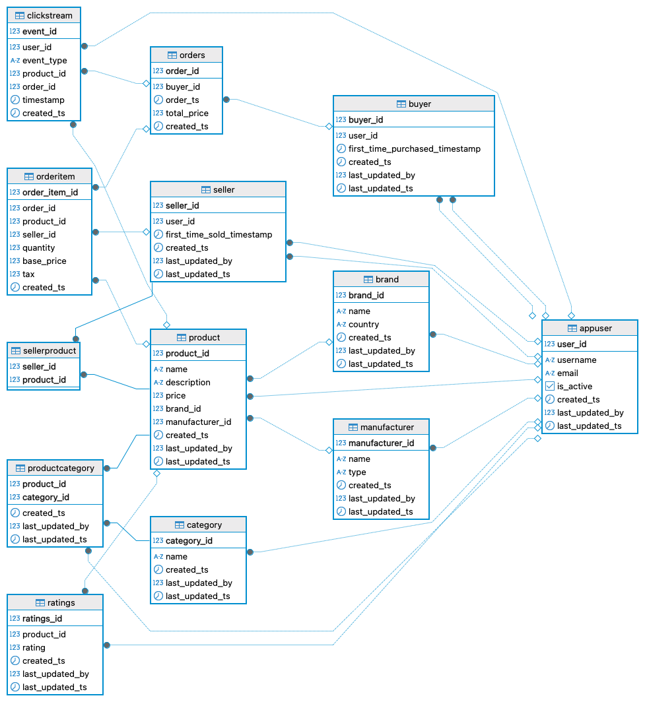
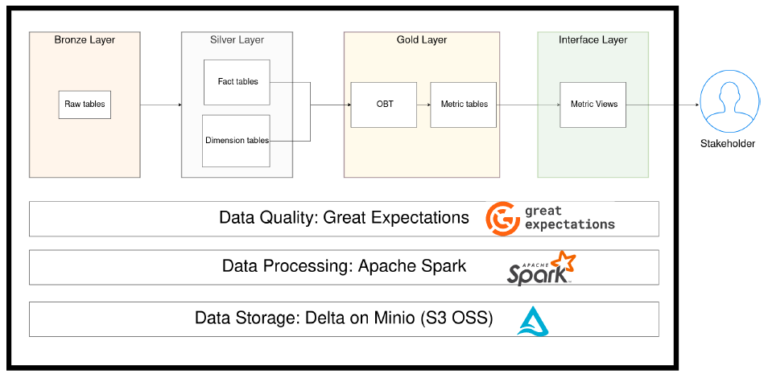

# Rainforest E-Commerce Spark Data Engineering Pipeline

> An end-to-end, production-grade data engineering pipeline for a synthetic e-commerce platform — built with Apache Spark, Medallion Architecture, Delta Lake, MinIO, PostgreSQL, and Docker.

**Author:** [Anshul Chaudhary](https://github.com/morid648)

**Stack:** Apache Spark · Python · Delta Lake · Medallion Architecture · MinIO (S3-compatible) · PostgreSQL · Great Expectations · PyTest · Docker


---

## Table of Contents
1. [Overview](#overview)
2. [Key Capabilities](#key-capabilities)
3. [Infrastructure](#infrastructure)
4. [Data](#data)
5. [Pipeline Design — Medallion Architecture](#pipeline-design--medallion-architecture)
6. [Data Model](#data-model)
7. [Code Organisation](#code-organisation)
8. [Testing](#testing)
9. [Repository Structure](#repository-structure)
10. [Setup & Run Locally](#setup--run-locally)
11. [Available Make Commands](#available-make-commands)
12. [Project Deliverables](#project-deliverables)


---

## Overview

This project designs and implements a robust, industry-standard data pipeline for a simulated e-commerce company called **Rainforest**. The pipeline ingests synthetic transactional data from a PostgreSQL upstream database, processes it through a Medallion Architecture (Bronze → Silver → Gold → Interface), applies data quality validation using Great Expectations, and produces two daily business reports.

All processing runs locally inside Docker — a Spark cluster, a MinIO S3-compatible data lake, and a PostgreSQL upstream database are all containerised and orchestrated with Docker Compose, making the entire stack reproducible with a single `make up` command.

---

## Key Capabilities

| Capability | Implementation |
|---|---|
| Distributed processing | Apache Spark cluster (1 master + 2 workers) |
| Medallion Architecture | Bronze → Silver → Gold → Interface layers |
| Data lake storage | MinIO (local S3-compatible) with Delta Lake format |
| OOP-based ETL | Abstract base class `TableETL` — each table inherits and implements Extract, Transform, Validate, Write, Read |
| Metadata-driven pipeline | `ETLDataSet` dataclass encapsulates storage path, format, partition keys, database, and schema |
| Data quality validation | Great Expectations — duplicate checks + revenue threshold validation |
| Unit testing | PyTest — 13 bronze-layer unit tests + 4 silver-layer unit tests |
| Integration testing | PyTest — end-to-end fact table integration test |
| Synthetic data generation | Faker-based Python script populates PostgreSQL upstream |
| Daily reports | Category revenue report + Order revenue report via Interface layer views |
| One Big Table (OBT) | Gold layer wide tables join all relevant dimensions for analytics-ready datasets |

---

## Infrastructure

Three services form the local data platform:

```
┌─────────────────────────────────────────────────────────┐
│                    Docker Compose                        │
│                                                          │
│  ┌─────────────────┐   ┌─────────────────────────────┐  │
│  │   PostgreSQL     │   │       Spark Cluster          │  │
│  │  (upstream DB)   │   │  Master + 2 Workers          │  │
│  │  rainforest      │   │  + History Server            │  │
│  │  schema          │   │  Spark UI: localhost:9090    │  │
│  └────────┬─────────┘   └──────────────┬──────────────┘  │
│           │  JDBC                       │                 │
│           └─────────────────────────────┘                 │
│                         │                                 │
│                         ▼                                 │
│              ┌──────────────────────┐                     │
│              │       MinIO           │                     │
│              │  (S3-compatible      │                     │
│              │   data lake)         │                     │
│              │  Console: :9001      │                     │
│              └──────────────────────┘                     │
└─────────────────────────────────────────────────────────┘
```

**Ports exposed:**
| Service | Port |
|---|---|
| Spark Master UI | localhost:9090 |
| Spark Application UI | localhost:4040 |
| Spark History Server | localhost:18080 |
| MinIO API | localhost:9000 |
| MinIO Console | localhost:9001 |
| PostgreSQL | localhost:5432 |

---

## Data

Synthetic data is generated using the **Faker** library and loaded into a PostgreSQL `rainforest` schema. The data simulates a real e-commerce platform — buyers, sellers, products, orders, order items, ratings, and clickstream events.

### Conceptual Model

The conceptual model shows high-level business entity interactions — buyers purchase products from sellers, products belong to categories, and orders contain items.



### Entity-Relationship Diagram

The ERD defines the upstream PostgreSQL tables, their attributes, and relationships.



**Upstream tables:** `appuser`, `buyer`, `seller`, `brand`, `manufacturer`, `product`, `category`, `product_category`, `seller_product`, `orders`, `order_item`, `ratings`, `clickstream`

---

## Pipeline Design — Medallion Architecture



### Bronze Layer
Pulls raw data from the upstream PostgreSQL database via JDBC, adds an `etl_inserted` timestamp partition column, and writes to MinIO in Delta format.

**13 tables:** appuser, brand, buyer, category, clickstream, manufacturer, order_item, orders, product, product_category, ratings, seller, seller_product

### Silver Layer
Models cleaned Bronze data into fact, dimension, and bridge tables. Applies business transformations (e.g. currency conversions, joins, type casting).

**Fact tables:**
- `fact_orders` — order-level data (one row per order); adds `total_price_usd` and `total_price_inr`
- `fact_order_items` — item-level data (one row per item, linked to orders via `order_id`)

**Dimension tables:**
- `dim_buyer` — buyer info (join of buyer + appuser tables)
- `dim_seller` — seller info (join of seller + appuser tables)
- `dim_category` — category information
- `dim_product` — product information with metrics

**Bridge tables:**
- `bridge_product_category` — maps products to multiple categories
- `bridge_seller_product` — maps sellers to multiple products

### Gold Layer
Joins and aggregates Silver fact and dimension tables into **One Big Tables (OBTs)** and daily metric tables. This is the analytics-ready layer.

- `wide_orders_gold` — OBT joining orders with buyer, seller, and product dimensions
- `wide_order_items_gold` — OBT joining order items with all relevant dimensions
- `daily_order_metrics` — total and average revenue aggregated by day (validates: avg revenue ≤ 100,000 USD)
- `daily_category_metrics` — average and median revenue aggregated by day and product category (validates: avg revenue ≤ 100,000 USD)

### Interface Layer
Creates global temporary views on top of Gold metric tables for direct stakeholder querying via Spark SQL.

- `daily_order_report` — view on `daily_order_metrics`
- `daily_category_report` — view on `daily_category_metrics`

---

## Data Model

### ETLDataSet — Metadata Dataclass
Every dataset in the pipeline is wrapped in an `ETLDataSet` dataclass that carries:

| Attribute | Purpose |
|---|---|
| `name` | Table name (matches Great Expectations expectation suite) |
| `current_data` | Spark DataFrame |
| `primary_keys` | List of PK columns |
| `storage_path` | MinIO S3A path (e.g. `s3a://rainforest/delta/bronze/orders`) |
| `data_format` | Storage format (`delta`) |
| `database` | Database name (`rainforest`) |
| `partition_keys` | Partition columns (always `etl_inserted` for time-based partitioning) |

### Storage Paths (MinIO)
```
s3a://rainforest/
  delta/
    bronze/   → raw tables (13 tables)
    silver/   → fact, dim, bridge tables
    gold/     → OBTs and metric tables
```

---

## Code Organisation

### Abstract Base Class: `TableETL`
Every ETL table class inherits from `TableETL` and implements three abstract methods:

| Method | Responsibility |
|---|---|
| `extract_upstream()` | Pull data from upstream sources (PostgreSQL or upstream layer tables) |
| `transform_upstream()` | Apply business transformations and return an `ETLDataSet` |
| `read()` | Read the table back from MinIO with consistent column selection |

Two non-abstract methods are shared across all tables:

| Method | Responsibility |
|---|---|
| `validate()` | Run Great Expectations checkpoint if an expectation file exists for this table |
| `write()` | Write ETLDataSet to MinIO in Delta format, partitioned by `etl_inserted` |

`run()` orchestrates the full ETL cycle: `extract → transform → validate → write`

### Pipeline Execution
`run_etl.py` is the entrypoint — it instantiates the two Gold-layer metric ETLs (which recursively trigger all upstream Bronze and Silver tables), then creates Interface views and displays results.

The dependency graph is implicit in the `upstream_tables` attribute of each class — no external orchestrator needed.

---

## Testing

### Data Quality Testing — Great Expectations
Three expectation suites are defined:

| Suite | Checks |
|---|---|
| `orders` | No duplicate `order_id` values |
| `fact_orders` | No duplicate `order_id` values (post-Silver transformation) |
| `daily_order_metrics` | Average revenue does not exceed 100,000 USD |

Great Expectations is integrated directly into the `validate()` method of `TableETL` — validation runs automatically as part of every `run()` call before data is written.

### Code Logic Testing — PyTest
```
etl/test/
├── conftest.py                    (shared Spark session fixture)
├── unit_tests/
│   ├── bronze/                    (13 unit tests — one per bronze table)
│   └── silver/                    (4 unit tests — buyer, product, seller, fact_order_items)
└── integration/
    └── test_integration_fact_order_items.py  (end-to-end integration test)
```

**Run all tests:**
```bash
make test
```

**Run a specific test file:**
```bash
make test TEST=unit_tests/bronze/test_orders_bronze.py
```

---

## Repository Structure

```
rainforest-spark-pipeline/
│
├── run_etl.py                         ← Pipeline entrypoint (spark-submit target)
├── docker-compose.yml                 ← Full local infrastructure (Spark + MinIO + Postgres)
├── Makefile                           ← All project commands
├── .env.example                 ← Spark environment variable template
├── .gitignore
│
├── spark/                             ← Spark cluster configuration
│   ├── Dockerfile
│   ├── entrypoint.sh
│   ├── create_buckets.py
│   ├── requirements.txt
│   └── conf/
│       ├── spark-defaults.conf
│       └── metrics.properties
│
├── datagen/                           ← Synthetic data generation
│   ├── datagen.py                     ← Faker-based data generator
│   └── upstream_data.sql              ← PostgreSQL schema DDL
│
├── etl/                               ← ETL pipeline code
│   ├── utils/
│   │   ├── base_table.py              ← Abstract TableETL base class + ETLDataSet
│   │   └── database.py                ← JDBC upstream reader
│   │
│   ├── layers/
│   │   ├── bronze/                    ← 13 raw ingestion tables
│   │   ├── silver/                    ← 8 fact/dim/bridge tables
│   │   ├── gold/                      ← 4 OBT and metric tables
│   │   └── interface/                 ← 2 Spark SQL report views
│   │
│   ├── great_expectations/            ← Data quality framework
│   │   ├── great_expectations.yml
│   │   ├── checkpoints/
│   │   └── expectations/              ← 3 expectation suites (orders, fact_orders, daily_order_metrics)
│   │
│   └── test/                          ← PyTest suite
│       ├── conftest.py
│       ├── unit_tests/
│       │   ├── bronze/                ← 13 unit tests
│       │   └── silver/                ← 4 unit tests
│       └── integration/               ← 1 integration test
│
└── images/                            ← Architecture and data model diagrams
    ├── architecture.png
    ├── entity_relationship_diagram.png
    └── conceptual_data_model.png
```

---

## Setup & Run Locally

> Requires: Docker Desktop, Make

### 1. Clone the Repository
```bash
git clone https://github.com/morid648/rainforest-spark-pipeline.git
cd rainforest-spark-pipeline
```

### 2. Build and Start Infrastructure
```bash
make up
```
Builds the Spark image and starts all services (Spark master, 2 workers, history server, MinIO, PostgreSQL).

### 3. Generate Data and Create MinIO Bucket
```bash
make setup
```
Generates synthetic e-commerce data into PostgreSQL and creates the `rainforest` bucket in MinIO.

### 4. Run the Pipeline End-to-End
```bash
make project
```
Submits `run_etl.py` to the Spark cluster via `spark-submit`. Runs all Bronze → Silver → Gold → Interface layers and prints the two daily reports to console.

### 5. Run Tests
```bash
make test
```

---

## Available Make Commands

| Command | Description |
|---|---|
| `make up` | Build Spark image and start all Docker services |
| `make down` | Stop and remove all containers and volumes |
| `make setup` | Generate fake data + create MinIO buckets |
| `make project` | Run the full ETL pipeline via spark-submit |
| `make test` | Run the full PyTest suite |
| `make test TEST=<path>` | Run a specific test file |
| `make bash` | Open a bash shell inside the Spark master container |
| `make reset` | Tear down and restart from scratch |
| `make mypy` | Run mypy type checks |

---

## Project Deliverables

### Daily Order Report
Total and average revenue aggregated by order date across all active orders.

| Column | Description |
|---|---|
| `order_date` | Trading date |
| `total_price_sum` | Total revenue for the day |
| `total_price_mean` | Average order value for the day |

### Daily Category Report
Average and median revenue by product category per day.

| Column | Description |
|---|---|
| `order_date` | Trading date |
| `category_name` | Product category |
| `avg_revenue` | Average revenue for the category on that day |
| `median_revenue` | Median revenue for the category on that day |

**Data quality guarantee:** Both reports are validated by Great Expectations before being made available — average revenue must not exceed 100,000 USD. Reports that fail validation are not written to storage.

---

## License

Licensed under the [MIT License](LICENSE).
